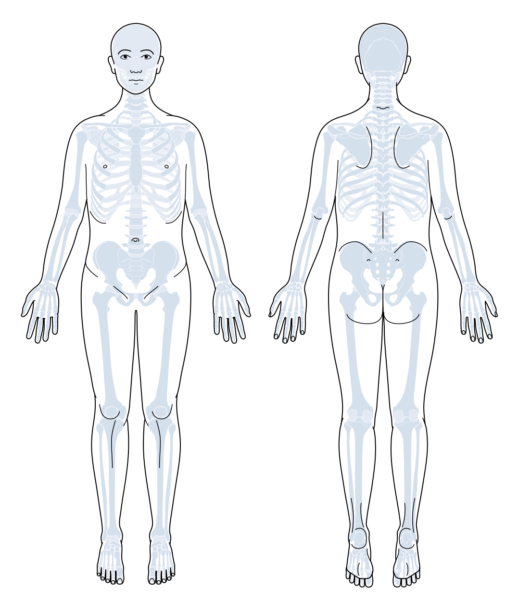

[](https://example.com)

# Open-Source Anatomical Illustration for Digital Back Pain Documentation

## Paper Reference

This repository accompanies our paper:

> **Open-Source Anatomical Illustration for Digital Back Pain Documentation: Development and Evaluation**  
> _Yanick X. Lukic, Sonja Schläpfer, Alessandro Holler, Giovanni Colacicco, Dennis Baumli, Leana Wirth, Steven Häsler, Christoph J. Laux, Reto Sutter, Georg Wilhelm Kajdi, Benedikt Herzog, Sebastiano Caprara, Claudia M. Witt, and Philipp Ackermann (2025)_

If you use this illustration, please cite our paper:

```bibtex
@article{Lukic2025Illustration,
  title = {Open-Source Anatomical Illustration for Digital Back Pain Documentation: Development and Evaluation},
  author = {Yanick X. Lukic and Sonja Schläpfer and Alessandro Holler and Giovanni Colacicco and Dennis Baumli and Leana Wirth and Steven Häsler and Christoph J. Laux and Reto Sutter and Georg Wilhelm Kajdi and Benedikt Herzog and Sebastiano Caprara and Claudia M. Witt and Philipp Ackermann},
  journal = {JMIR Preprints},
  year = {2025},
  note = {Preprint published on 09/04/2025},
  doi = {10.2196/preprints.75737},
  url = {https://preprints.jmir.org/preprint/75737}
}
```

---

## Summary of This Repository

- **Goal**: Provide an open-source, anatomically accurate SVG illustration (front/back views) for standardized back pain documentation.
- **Why It Matters**: Integrates with SNOMED CT (via `svg_to_snomed.json`), facilitating interoperable pain annotation and EHR integration.
- **How To Use**:
  - Use or adapt `illustration/*.svg` under CC BY 4.0.
  - MIT-licensed software/scripts are in `mappings/` and `utils/`.
  - See [LICENSE](./LICENSE) and [LICENSE-SOFTWARE](./LICENSE-SOFTWARE) for details on usage rights.

For further information on how the illustrations and SNOMED mapping were developed—or to learn more about our user study—see the paper (linked above) and the documentation throughout this repository.

---

# Repository Structure

```
repo-root/
│
├── illustration/{version}/ → CC-BY-4.0
│ ├── anatomical_illustration.svg
│ └── anatomical_illustration_colored.svg
│
├── mappings/{version}/ → MIT
│ └── svg_to_snomed.json
│
├── utils/ → MIT
│ └── extract_ids.py
│
├── LICENSE
├── LICENSE-SOFTWARE
├── CITATION.cff
└── README.md
```

# Illustration

## 1. **Base Medical Illustration (`anatomical_illustration.svg`)**

<p align="center">
  
  <p><em>Standard anatomical diagram (anterior/posterior views) with element IDs mapped to SNOMED codes in <code>svg_to_snomed.json</code></em></p>
</p>

## 2. **Colored Visualization of the Different SVG Elements (`anatomical_illustration_colored.svg`)**

<p align="center">
  
  <p><em>Visualization of the different SVG regions</em></p>
</p>

---

# Mapping

## Core Illustration (`body_front_back.svg`)

```xml
<!-- Example: Clavicula Section -->
<g id="bones-pos-clavicula">
        <path
           id="bones-ant-clavicula-sin"
           class="cls-3"
           d="M917.1,260.5v-.2c.6-2.4-2.7-5-4.9-4.9-.8,0-1.7.1-2.6.3-5.8,1-11.4.1-17-.6-8.1-1.1-16.7.2-25,1.3-11.8,2.2-23,3.3-35,2.5-3.5-.2-7-1.3-10.5-1.2-1.6,0-4.5.2-6.3.2-4.5,0-2.8,4.2-2.1,6,1,1.8,2.9,4.4,6.1,5.1,2.6.7,4.9-.2,6.9-1,6.7-2.6,14.7-2.5,21.8-2.8,5-.2,10-.3,15-.2,4.9,0,9.1-2,13.8-3.2,10.6-2.5,21.5-.5,31.9.4,1.6.1,3.3.5,5,.2,1.2-.2,2.5-.7,3-2h-.1Z" />
           ...
</g>
```

## Terminology Mapping

This project references **SNOMED CT Concept Identifiers (SCTIDs)** and is intended for use by individuals or organizations appropriately licensed to use SNOMED CT. For more information on licensing, please visit [snomed.org](https://www.snomed.org/get-snomed).

You can look up full concept descriptions using the [SNOMED CT Browser](https://browser.ihtsdotools.org).

**SVG-to-SNOMED** (`svg_to_snomed.json`):

```json
{
  "bones-ant-clavicula-sin": "720616002",
  "bones-ant-columna-T06": "45296009",
  "bones-ant-clavicula": "181910004"
}
```

ℹ️ This file contains SNOMED CT Concept IDs only, without any SNOMED CT descriptions or terms, in accordance with SNOMED International’s distribution guidelines.

---

# License

For clarity about which components fall under each license, see the [Repository Structure](#repository-structure) where all directories are marked with their applicable licenses (→ CC-BY-4.0 or → MIT).

## Illustration


The illustration is licensed under a [Creative Commons Attribution 4.0 International License](LICENSE). When using the illustration, you must:

- **Cite the paper** — (see [Citation](https://preprints.jmir.org/preprint/75737))
- **Attribution** — You must give **appropriate credit**, provide a link to the license, and **indicate if changes were made**. You may do so in any reasonable manner, but not in any way that suggests the licensor endorses you or your use.
- **No additional restrictions** — You may not apply legal terms or **technological measures** that legally restrict others from doing anything the license permits.

## Software


The software components are licensed under the [MIT License](LICENSE-SOFTWARE).

---

# Contributing

We welcome improvements to SVG mappings or documentation!

- Read our [Contribution Guidelines](CONTRIBUTING.md).
- Report issues for missing medical codes or anatomical inaccuracies.
